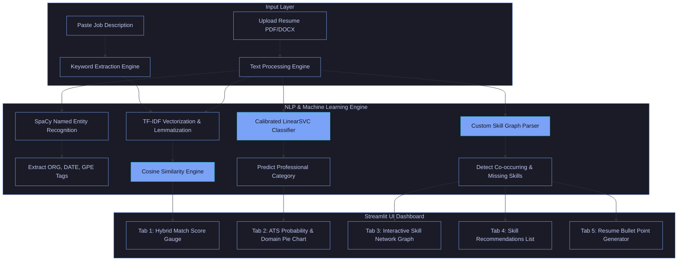
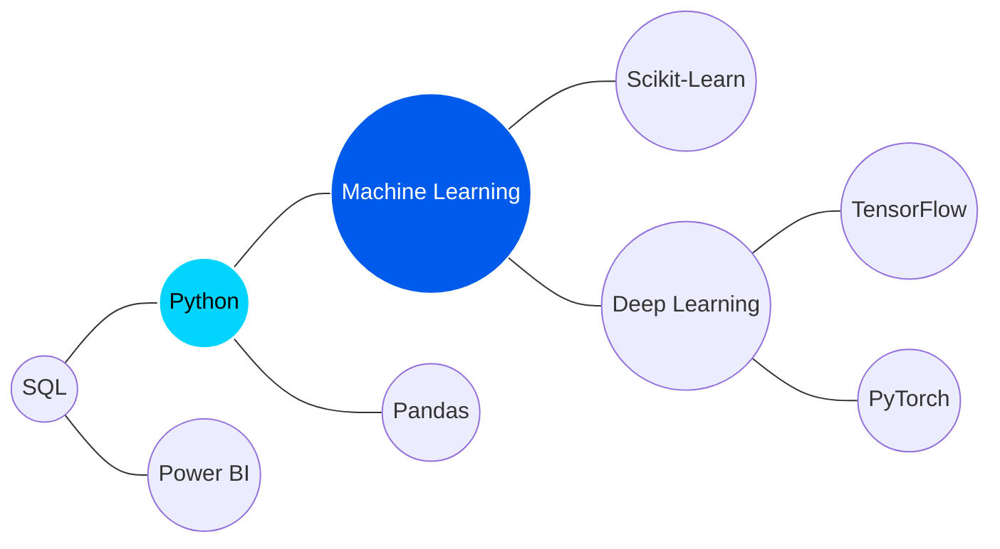

# 🤖 Resume Skill Matcher Pro AI

<div align="center">
  
  [](https://www.python.org/)
  [](https://streamlit.io/)
  [](https://scikit-learn.org/)
  [](https://spacy.io/)
  [](https://opensource.org/licenses/MIT)
  [](#)

  <p align="center">
    <strong>An advanced, AI-powered resume parser, Applicant Tracking System (ATS) compatibility evaluator, and career development assistant.</strong>
  </p>
  
  <h4>
    <a href="#-project-overview">Overview</a> | 
    <a href="#-key-features">Features</a> | 
    <a href="#%EF%B8%8F-system-architecture">Architecture</a> | 
    <a href="#-machine-learning--data-science-details">ML Model</a> | 
    <a href="#-installation--setup">Setup</a> | 
    <a href="#-usage-guide">Usage</a>
  </h4>
</div>

---

## 🔍 Project Overview

In the contemporary recruitment landscape, Applicant Tracking Systems (ATS) act as corporate gatekeepers, filtering out up to **75% of resumes** before they are ever reviewed by human eyes. Many qualified candidates are rejected due to formatting issues, keyword omissions, or lack of semantic alignment with the job description.

**Resume Skill Matcher Pro AI** is a professional data science application built to bridge this transparency gap. By acting as a sophisticated "Mock ATS", the platform evaluates resumes against specific job descriptions in real-time. Unlike basic keyword search algorithms, this system combines term-frequency parsing with semantic density metrics, categorizes the candidate's professional domain using a machine learning model, identifies key missing skills, and employs a custom skill-cooccurrence graph to recommend actionable improvements.

---

## ⚠️ Problem Statement & Objectives

### The Problem
*   **Keyword Optimization Barrier**: Applicants describe their skills using generic verbs or synonyms (e.g., "created programs") that fail to match the specific terms indexed by recruiters (e.g., "Python Software Development").
*   **The Feedback Vacuum**: Candidates submit applications and receive automated rejection emails with no details, preventing them from iterating or tailoring their resumes.
*   **Skill Inflation Detection**: Basic scanners reward keyword-stuffed resumes. Companies need a way to verify if listed skills are backed up by actual project experience.

### Objectives
1.  **Robust Parsing Engine**: Extract text, metadata, and sections from multiple document formats (`.pdf`, `.docx`).
2.  **Semantic Match Metrics**: Implement cosine similarity vector models alongside strict keyword-intersection rates to output a balanced **Hybrid Match Score**.
3.  **Industry Classification**: Train a robust supervised machine learning pipeline to predict a resume's professional domain across 25 standard fields.
4.  **Actionable Skill Recommendations**: Leverage a co-occurrence knowledge graph to recommend complementary skills and auto-generate resume bullet points targeting missing competencies.
5.  **Interactive Analytical Frontend**: Deliver detailed visual diagnostics using dynamic charts (gauge widgets, pie charts, and spring-layout network diagrams).

---

## 🌟 Key Features

| Feature | Icon | Description |
| :--- | :---: | :--- |
| **Multi-Format Parsing** | 📄 | Automatically parses raw text, layouts, and characters from PDF and DOCX files. |
| **Hybrid Matching Engine** | 🎯 | Calculates compatibility via **30% Semantic Similarity** (TF-IDF Vector distance) and **70% Keyword Coverage Ratio**. |
| **ATS Score Predictor** | 🤖 | Estimates acceptance probability based on structural markers (email/phone presence), section headers (Experience, Projects, Education), and readability. |
| **Domain Classifier** | 📊 | Uses a trained machine learning pipeline to identify the candidate's professional category (e.g., *Data Science, HR, Sales*). |
| **Knowledge Graph Suggestions** | 🕸️ | Queries a local co-occurrence network to recommend statistically relevant industry skills. |
| **A.I. Bullet-Point Generator** | 💡 | Creates ready-to-use, tailored resume bullet points for any missing target keywords. |
| **Readability Auditing** | 📈 | Computes Flesch Reading Ease scores to flag text that is too dense or too sparse. |
| **Fake Skill Checker** | 🔍 | Scans listed skills against paragraph contexts to identify keywords added without surrounding evidence. |

---

## ⚙️ System Architecture & Workflow

The platform follows a modular pipeline processing inputs from the client presentation layer to the analytics engine and serving results back dynamically.



### Data Pipeline Details
1. **Text Normalization**: Regex cleanup strips emojis, formatting, and non-alphabetic elements. Tokens are converted to lowercase.
2. **Lemmatization & Stopwords**: The NLTK stopword list is pruned to preserve specialized technical tokens (e.g., `C++`, `IT`) and Spacy lemmatizes words to their base form.
3. **Entity Extraction**: A pre-trained `en_core_web_sm` model extracts names, locations, date ranges, and organizations.

---

## 🔬 Machine Learning & Data Science Details

### 1. Classification Model
To identify a candidate's background, the model classifies resumes into one of 25 distinct industry domains.

*   **Algorithm**: **Linear Support Vector Classifier (LinearSVC)** wrapped in `CalibratedClassifierCV` (to provide category probabilities rather than hard labels).
*   **Vectorization Strategy**: 
    *   **TF-IDF Vectorizer** (Term Frequency-Inverse Document Frequency).
    *   `ngram_range=(1, 2)` to capture phrases like "machine learning" or "software development".
    *   `max_features=10000` features, ignoring terms appearing in $< 2$ documents (`min_df=2`) or $> 85\%$ of resumes (`max_df=0.85`).
*   **Performance Metrics**:
    *   **Training Accuracy**: `99.0%`
    *   **Test Accuracy**: `96.0%`

### 2. Mathematics of the Matching Engine

The matching score is modeled using a weighted balance:
$$\text{Match Score} = (0.30 \times \text{Cosine Similarity}) + (0.70 \times \text{Keyword Coverage Ratio})$$

Where **Cosine Similarity** measures the angle between TF-IDF sparse vectors of the Resume ($A$) and Job Description ($B$):
$$\text{Cosine Similarity}(A, B) = \frac{A \cdot B}{\|A\| \|B\|} = \frac{\sum_{i=1}^{n} A_i B_i}{\sqrt{\sum_{i=1}^{n} A_i^2} \sqrt{\sum_{i=1}^{n} B_i^2}}$$

### 3. Skill Knowledge Graph
A local skill database is initialized as a network graph based on skill co-occurrences within the Kaggle resume corpus (~900 documents). 


If a resume contains **Python** and **Machine Learning**, the co-occurrence graph queries adjacent missing nodes like **Pandas** or **Scikit-Learn** to recommend to the user.

---

## 📂 Repository Structure

The project codebase is organized modularly to separate frontend presentation from algorithmic routines:

```text
📁 Resume-AI/
├── 📄 app.py                     # Streamlit frontend, page routing, tabs UI
├── 📄 ats_model.py               # ATS metrics calculations and LinearSVC inference
├── 📄 utils.py                   # File extractors (PDF/Word), NLP cleaners, regex rules
├── 📄 visualizations.py          # Plotly rendering (ATS Gauge, Network Graph, Pie Chart)
├── 📄 train_models.py            # Pipelines training pipeline (TF-IDF & LinearSVC training)
├── 📄 style.css                  # Modern layout overrides for the Streamlit container
├── 📄 skill_graph.json           # Adjacency list representing skill co-occurrences
├── 📄 category_keywords.json     # Extracted TF-IDF key terms sorted by domain
├── 📄 requirements.txt           # Declared project dependency pins
├── 📄 FINAL_REPORT.md            # Academic project summary document
└── 📄 PROJECT_REPORT_FULL.md     # Extended project dissertation document
```

Files are documented and linkable locally:
*   [app.py](file:///c:/Users/aashi/OneDrive/Documents/PROJECTS%5BDS%5D/Resume-AI/app.py)
*   [ats_model.py](file:///c:/Users/aashi/OneDrive/Documents/PROJECTS%5BDS%5D/Resume-AI/ats_model.py)
*   [utils.py](file:///c:/Users/aashi/OneDrive/Documents/PROJECTS%5BDS%5D/Resume-AI/utils.py)
*   [visualizations.py](file:///c:/Users/aashi/OneDrive/Documents/PROJECTS%5BDS%5D/Resume-AI/visualizations.py)
*   [train_models.py](file:///c:/Users/aashi/OneDrive/Documents/PROJECTS%5BDS%5D/Resume-AI/train_models.py)
*   [requirements.txt](file:///c:/Users/aashi/OneDrive/Documents/PROJECTS%5BDS%5D/Resume-AI/requirements.txt)
*   [style.css](file:///c:/Users/aashi/OneDrive/Documents/PROJECTS%5BDS%5D/Resume-AI/style.css)

---

## 🚀 Installation & Setup

Ensure you have **Python 3.9+** installed on your workstation.

### 1. Clone the Repository
```bash
git clone https://github.com/AaShIrVaD-kV/Resume-AI.git
cd Resume-AI
```

### 2. Set Up Virtual Environment (Recommended)
```bash
# Windows
python -m venv venv
venv\Scripts\activate

# macOS / Linux
python3 -m venv venv
source venv/bin/activate
```

### 3. Install Dependencies
```bash
pip install -r requirements.txt
```

### 4. Install Language Models
Download the essential SpaCy language assets:
```bash
python -m spacy download en_core_web_sm
```

---

## 💻 Usage Guide

### Running the Web Interface
Start the Streamlit development server locally:
```bash
streamlit run app.py
```
Open [http://localhost:8501](http://localhost:8501) in your browser to interact with the dashboard.

### Retraining the Models
If you update the source resume dataset, run the training pipeline to regenerate the serialized classifier and knowledge bases:
```bash
# Ensure your dataset is located in 'Resume/Resume.csv'
python train_models.py
```

### Python API Integration
You can use the text preprocessing and classifier libraries programmatically within your own scripts:

```python
from utils import clean_text, calculate_similarity
from ats_model import predict_category, predict_ats_score

# 1. Clean raw text content
raw_resume = "Highly motivated Data Scientist with expertise in Python, SQL, and Machine Learning."
cleaned_resume = clean_text(raw_resume)

# 2. Programmatically identify the resume's industry domain
domain_probabilities = predict_category(cleaned_resume)
print("Top Categories:", domain_probabilities)

# 3. Calculate alignment against a target job description
job_description = "We are seeking a Python developer skilled in Machine Learning and SQL databases."
match_pct = calculate_similarity(raw_resume, job_description)
print(f"Semantic Alignment: {match_pct}%")
```

---

## 📊 Evaluation & Performance Metrics

The LinearSVC classification model shows high recall and precision scores across diverse professional sectors on the test dataset split:

| Metric | Score / Level | Source Configuration |
| :--- | :---: | :--- |
| **Model Classification Accuracy** | **96.0%** | Test Split validation (Stratified 80-20) |
| **Model Training Accuracy** | **99.0%** | Full dataset convergence fit |
| **Flesch Reading Ease Target** | **60.0 - 70.0** | standard target range for optimal readability |
| **Maximum Upload Threshold** | **200 MB** | Streamlit file handler allocation limits |

<details>
<summary>💡 View Classification Calibration Insights</summary>
Using `CalibratedClassifierCV` ensures that output probabilities are well-calibrated (i.e. a predicted confidence of 80% matches an empirical accuracy of 80%). This provides job seekers with a realistic distribution of how multiple target industries might interpret their resume.
</details>

---

## 🎨 Interface & Screenshots

Below are placeholders representing the Streamlit dashboard layout:

```text
+-----------------------------------------------------------------------------+
|  🤖 AI-Powered Resume Matcher & Career Assistant                            |
|  Advanced Analysis: ATS Score, Skill Graph, & Recommendations               |
+-----------------------------------------------------------------------------+
|  [ 📁 Upload Resume ]  (PDF/Word)      |  [ ✍️ Paste Target Job Desc ]        |
|  Drag and drop file here...            |  Paste description here...           |
|                                        |                                      |
+-----------------------------------------------------------------------------+
|                        [  🚀 Analyze Resume  ]                              |
+-----------------------------------------------------------------------------+
|  Tab 1: Match Score  |  Tab 2: ATS  |  Tab 3: Skill Graph  |  Tab 4: Recs   |
+-----------------------------------------------------------------------------+
|   🌟 Match Score: 82%                                                       |
|   ============================>                                             |
|   Status: Excellent alignment with job description.                        |
|   ❌ Missing Keywords: Kubernetes, Docker, PySpark                         |
+-----------------------------------------------------------------------------+
```

---

## 🛠️ Future Improvements

*   **Transformer Embeddings**: Transition from TF-IDF vector models to context-aware BERT/RoBERTa embeddings to parse nuanced sentence semantics.
*   **Cover Letter Customizer**: Add an LLM assistant module to auto-generate context-specific cover letters aligned with the resume gaps.
*   **Optical Character Recognition (OCR)**: Integrate Tesseract OCR to process scanned image resumes.
*   **Live Scraping Integrations**: Allow users to paste a LinkedIn or Indeed job URL directly, downloading the description on the fly.

---

## 🤝 Contribution Guidelines

Contributions are welcome! Please follow these steps to propose updates:
1. Fork the Project.
2. Create your Feature Branch (`git checkout -b feature/AmazingFeature`).
3. Commit your Changes (`git commit -m 'Add some AmazingFeature'`).
4. Push to the Branch (`git push origin feature/AmazingFeature`).
5. Open a Pull Request.

---

## 📄 License

Distributed under the MIT License. See `LICENSE` in the repository for details.

---

## ✍️ Author & Contact

*   **Developer**: [Your Name]
*   **GitHub Profile**: [@AaShIrVaD-kV](https://github.com/AaShIrVaD-kV)
*   **LinkedIn Connection**: [LinkedIn Link](https://linkedin.com/in/placeholder)
*   **Personal Portfolio**: [Portfolio Website](https://portfolio.placeholder)
*   **Email Address**: [your.email@example.com]

---
<p align="center">Made with ❤️ for final-year project development and career empowerment.</p>
